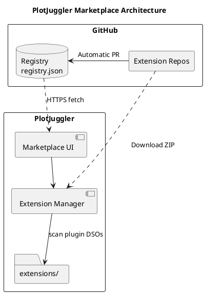
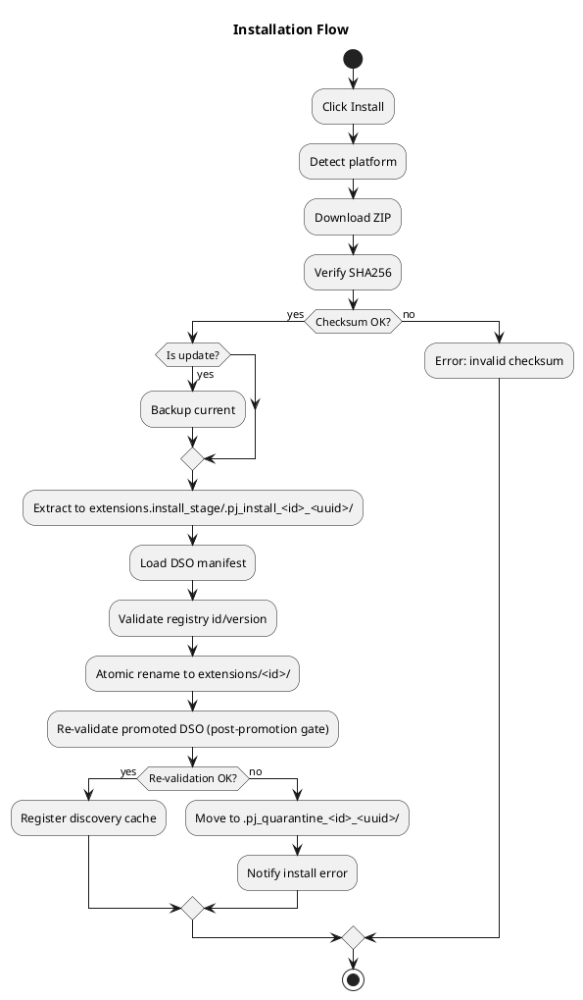
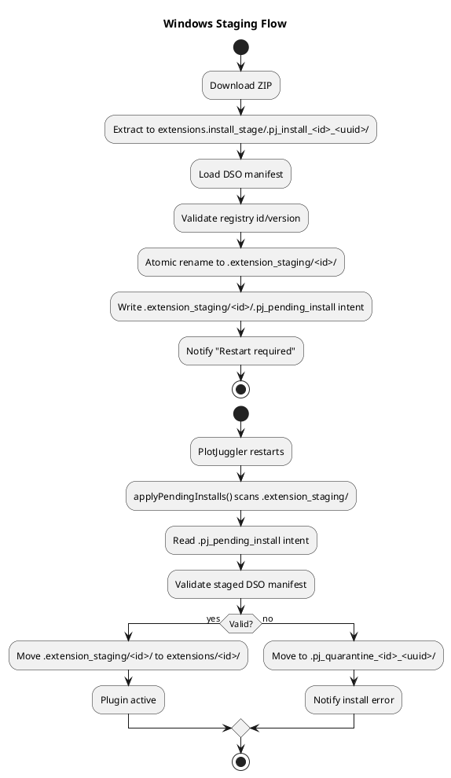
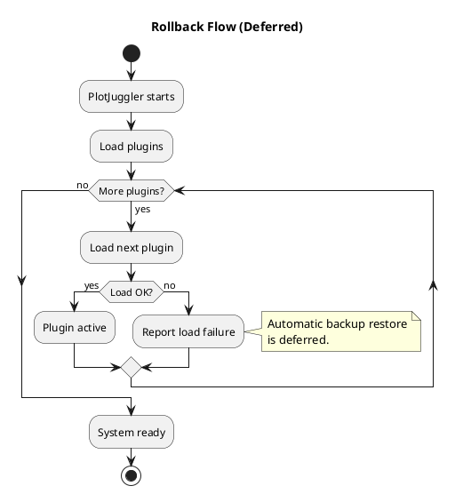

# PlotJuggler Marketplace — Architecture

> **Version:** 1.0.0
> **Last Updated:** 2026-05-19
> **Purpose:** Document HOW the system is designed and built

---

## 1. System Overview

### 1.1 High-Level Architecture


<details>
<summary>PlantUML source</summary>


</details>

### 1.2 Design Principles

| Principle | Rationale | Implementation |
|-----------|-----------|----------------|
| **Serverless** | Zero infrastructure costs | GitHub hosts everything |
| **CI-first** | Lower barrier for developers | Template with automated release |
| **Cross-platform** | PlotJuggler runs everywhere | Matrix build in CI |
| **Static linking** | Avoid dependency hell | Single .so/.dll per plugin |
| **Zero Qt in plugins** | ABI stability | Plugins use abstract SDK |
| **Dogfooding** | Ensure process works | Official plugins use same template |

---

## 2. Design Decisions

### 2.1 PlotJuggler Integration

Two approaches were considered: create an external plugin management tool (like `pip` or `npm`) or integrate it directly into PlotJuggler. The decision was clear: **native integration**.

The reasoning is that the typical PlotJuggler user doesn't want to leave the application to install plugins. They want to open a window inside PlotJuggler, search for what they need, install it, and keep working. It's the VSCode experience, not managing packages from a terminal.

The module ships **both as a standalone Qt app and as a static library embeddable in PJ4**, and CMake builds both targets unconditionally:

- `pj_marketplace` — static library with the core (`DownloadManager`, `ExtensionManager`, `RegistryManager`, `PlatformUtils`, `QtDiagnosticBridge`). No UI dependency.
- `pj_marketplace_ui` — static library with the Qt UI (`marketplace_window`, `extension_detail_dialog`).
- `pj_marketplace_app` — standalone executable that links both libraries above.

The standalone executable continues to exist precisely because it lets us iterate on the marketplace without rebuilding the whole PJ4 shell. The embedded `pj_app` integration consumes the same `pj_marketplace` / `pj_marketplace_ui` libraries, so behaviour stays in sync between the two entry points.

### 2.2 Plugin Template as Product

A key insight is that **the barrier to creating plugins is too high**. Configuring CMake, Conan, cross-platform CI... that's days of work before writing a single line of plugin code.

The solution is a **GitHub Template** that developers use as a starting point. They click "Use this template", clone the repo, and have:

- Preconfigured CI that compiles for Linux, Windows, and macOS
- Working Conan build system
- Project structure with examples
- Release workflow: creating a `v1.0.0` tag automatically triggers compilation, packaging, and publishing

The goal is that a developer with C++ experience can have their first plugin published in the marketplace **in a day**, not a week.

### 2.3 Build System: Conan, Pixi, and the Future

The C++ ecosystem has multiple dependency managers, and PlotJuggler has used several over time:

| Tool       | Status            | Context                                                                                                    |
| ---------- | ----------------- | ---------------------------------------------------------------------------------------------------------- |
| **CMake**  | Stable            | It's the de facto standard. No reason to change it.                                                        |
| **Conan**  | Active            | Works well, has good commercial support (JFrog), and the team has experience.                              |
| **Pixi**   | Under observation | It's gaining traction in the ROS community. Offers reproducible environments similar to conda but lighter. |
| **Colcon** | Abandoned         | Was necessary for ROS 1/2 integration, but added unnecessary complexity outside that context.              |

The current decision is to **use Conan for the plugin template**, but design the system so that generated artifacts are independent of the build tool. A ZIP with one or more plugin DSOs works the same whether it was generated with Conan, Pixi, or manual compilation; installed metadata is read from each DSO's embedded manifest.

**Pixi timeline:**
1. **Short term:** Template uses Conan (already works, already tested)
2. **Medium term:** Add Pixi support as an alternative in the template
3. **Long term:** Evaluate if Pixi can replace Conan based on community adoption

The important thing is that this decision **doesn't affect marketplace users**. They just see plugins that install with one click.

### 2.4 Sizing

The system is designed for a modest catalog:

- **Current plugins:** ~20
- **Expected short-term:** ~30
- **Maximum estimate:** 40-50

This means a simple JSON file is more than sufficient as a registry. We don't need a database, we don't need sophisticated search. A JSON with 50 entries loads in milliseconds.

---

## 3. Component Design

### 3.1 Core Components

Public headers live under `include/pj_marketplace/`; sources are split between `src/core/` (CamelCase) and `src/ui/` (snake_case to match `.ui` filenames).

```
pj_marketplace/
├── CMakeLists.txt
├── main.cpp
├── include/
│   └── pj_marketplace/
│       ├── extension.hpp                 # Extension metadata struct
│       ├── installed_extension.hpp       # Local installation record
│       ├── extension_manager.hpp         # Install/uninstall/update API + signals
│       ├── registry_manager.hpp          # Registry fetch/parse API
│       ├── download_manager.hpp          # HTTP + checksum + libarchive extraction
│       ├── platform_utils.hpp            # OS detection, standard paths
│       ├── qt_diagnostic_bridge.hpp      # Adapts a PJ::DiagnosticSink to a queued Qt diagnosticReported() signal
│       ├── marketplace.hpp               # Aggregate include
│       ├── marketplace_window.hpp        # Main dialog
│       └── extension_detail_dialog.hpp   # Per-extension detail dialog
└── src/
    ├── core/
    │   ├── ExtensionManager.cpp
    │   ├── RegistryManager.cpp
    │   ├── DownloadManager.cpp
    │   ├── PlatformUtils.cpp
    │   └── QtDiagnosticBridge.cpp
    └── ui/
        ├── marketplace_window.{cpp,ui}
        └── extension_detail_dialog.{cpp,ui}
```

`src/models/` and `src/utils/` exist as reserved directories (with `.gitkeep` files) but are empty today — the model headers live in `include/pj_marketplace/` and there are no shared utilities yet.

### 3.2 Data Models

#### extension.hpp
```cpp
struct Platform {
    QString url;
    QString checksum;     // sha256:<hex>
};

struct ExtensionPlugin {
    QString name;
    QString type;
    QString library;
};

struct Extension {
    QString id;
    QString name;
    QString description;
    QString author;
    QString publisher;
    QString website;
    QString repository;
    QString license;         // SPDX identifier
    QString icon_url;        // Optional
    QString category;        // "data_loader" | "data_streamer" | "parser" | "toolbox" | "bundle"
    QStringList tags;
    QString version;
    QString min_plotjuggler_version;

    QList<ExtensionPlugin> plugins;
    QMap<QString, Platform> platforms;  // linux-x86_64, windows-x86_64, etc.
    QMap<QString, QString> changelog;   // version -> description
};
```

#### installed_extension.hpp
```cpp
struct InstalledExtension {
    QString id;
    QString version;
    QDateTime install_date;
    QString path;
    bool enabled;
};
```

### 3.3 Component Responsibilities

| Component | Responsibility | Dependencies |
|-----------|---------------|--------------|
| **RegistryManager** | Fetch JSON, parse (no cache today — see REQUIREMENTS F-11) | QNetworkAccessManager |
| **ExtensionManager** | Install, uninstall, update, staged promotion, ring-buffer diagnostics, optional `PJ::DiagnosticSink` fan-out | DownloadManager, PlatformUtils, plugin catalog |
| **DownloadManager** | HTTP GET with progress, SHA256 verification, ZIP extraction | QNetworkAccessManager, QCryptographicHash, libarchive |
| **PlatformUtils** | Detect OS, get paths | Qt platform macros |
| **QtDiagnosticBridge** | Exposes a `PJ::DiagnosticSink` via `sink()` and re-emits each received `PJ::Diagnostic` as a thread-safe queued Qt signal `diagnosticReported(int level, QString source, QString id, QString message)` (queued delivery guarded by `QPointer`). Lets a host hand a Qt-free sink to non-GUI components (e.g. `ExtensionManager`, which takes a `DiagnosticSink` ctor param) and connect the signal to its UI. | Qt signals/slots |

#### ExtensionManager — Constructor Design

All dependencies are injected via constructor. The extensions directory defaults to
`PlatformUtils::extensionsDir()`, allowing tests to point to a temp directory without
mocking `PlatformUtils`:

```cpp
explicit ExtensionManager(DownloadManager* downloader,
                          const QString& extensions_dir = PlatformUtils::extensionsDir(),
                          const QString& pending_dir = PlatformUtils::pendingDir(),
                          DiagnosticSink sink = {},
                          QObject* parent = nullptr);
```

A companion no-arg `ExtensionManager()` overload also exists; it creates an owned
`DownloadManager` and uses the standard user directories.

**Design decisions:**
- No `setExtensionsDir()` public setter — directory is fixed at construction time
- No `detectPlatform()` private method — delegated to `PlatformUtils::currentPlatform()`
- Local installation state (`QMap<QString, InstalledExtension>`) is a private cache in `ExtensionManager` — populated at construction by scanning `extensions_dir`, loading plugin DSOs, and reading their embedded manifests; testability is preserved via the `extensions_dir` parameter pointing to a temp directory
- No local installed-state sidecars — disk is scanned, but `id` and `version` come from the embedded DSO manifest
- Staged updates write a transient `.pj_pending_install` intent containing the registry id/version. It is deleted after promotion and exists only so restart-time validation can compare the staged DSO against the registry request that created it. Both the id and the version inside the intent file are validated against the same safe-path/regex rules used elsewhere, so a tampered intent cannot escape `extensions_dir`.
- Embedding apps may seed the marketplace with a loaded-plugin snapshot before first render. That snapshot is initialization data, not a second source of truth; the embedded manifest remains the authority for installed state.
- **Pending queues drained at construction.** `ExtensionManager::initComponents()` runs `applyPendingUninstalls()` then `applyPendingInstalls()` before computing the installed snapshot, so restart-deferred work is processed regardless of which `MarketplaceWindow` constructor (or host wiring) ends up using the manager.
- **Duplicate-directory cleanup runs after the whole promotion loop.** `applyPendingInstalls()` first promotes every staged directory, then replaces prior same-id directories (`replaceConflictingInstallDirs`). The cleanup scan dlopens sibling directories to read their embedded ids, and opening a sibling's not-yet-promoted DSO would pin its old image in the process (glibc never unloads a DSO whose `STB_GNU_UNIQUE` symbols were bound), making the post-drain rescan report pre-update versions and the marketplace re-offer updates already on disk.
- **Restart-cleanup marker honors write failures.** `schedulePendingUninstall` returns `bool`; if the marker file cannot be written the in-memory entry is left intact and `uninstallError` is emitted, so an uninstall that cannot mark the directory does not silently revert on the next start.
- **Broken staged installs are quarantined, not retried forever.** When `applyPendingInstalls` fails to remove a rejected stage, the directory is renamed to `.pj_quarantine_<name>_<uuid>/` next to it. The next startup ignores quarantine entries and reports the path in the diagnostic so the user can inspect and clean it up.

#### ExtensionManager — Diagnostic propagation

`ExtensionManager` exposes its diagnostics three ways simultaneously:

| Channel | Audience | Notes |
|---------|----------|-------|
| `diagnostics()` accessor + 50-entry ring buffer | UI snapshot at any time | The marketplace window's "Diagnostics" dialog reads this. |
| `diagnosticReported(QString id, QString message, bool is_error)` Qt signal | Standalone marketplace UI | Pushes into the status bar. |
| Optional `PJ::DiagnosticSink` constructor parameter | Embedding hosts | Lets `PluginRegistry`, `ExtensionManager`, and any other module feed one chronological stream into a single GUI sink. |

See `pj_base/include/pj_base/diagnostic_sink.hpp` for the sink contract; the standalone `pj_marketplace_app` does not pass a sink, preserving the previous behavior unchanged.

---

## 4. Key Flows

### 4.1 Installation Flow

Both the immediate (Linux/macOS) and deferred (Windows) paths extract the
download into a hidden transaction directory (`.pj_install_<id>_<uuid>/`) under
`extensions.install_stage/` — a **sibling** of the extensions dir, so it shares
that dir's filesystem (the promoting rename stays atomic) while staying outside
the recursive plugin scan. Inside the scanned tree, a transaction holding an
unpacked DSO would be discoverable, loadable content, and it survives a crash;
the scanner applies no exclusion rule of its own. The DSO is **dlopened and its
embedded manifest validated** inside
the transaction directory before promotion, then **re-validated at the final
location** after the rename — this catches DSOs that depend on rpath/relative
paths that hold in the staging area but break in `extensions/`. On failure
the transaction directory is removed and no partial state survives.


<details>
<summary>PlantUML source</summary>


</details>

### 4.2 Windows Staging Flow


<details>
<summary>PlantUML source</summary>


</details>

### 4.3 Rollback Flow

Every successful update — Linux, macOS, and Windows — moves the previous
version into `.backup/<id>-<oldversion>/` before the new version takes its
place. On Linux/macOS this happens synchronously inside `update()`; on
Windows it happens at restart inside `applyPendingInstalls()`, just before
the staged directory is renamed over the existing one. If the staged
promotion fails after the backup move, `applyPendingInstalls()` attempts
to roll the backup back into place; if even the rollback fails, the
diagnostic surfaces both paths so the user can recover manually.

Automatic *post-load* rollback (restoring from backup if the freshly
installed plugin later fails to load) is deferred. The backup directory
is the manual recovery point.


<details>
<summary>PlantUML source</summary>


</details>

### 4.4 Bundled (Core) Extensions

Plugins shipped inside an installed build or AppImage live in the **bundled
dir** (`<prefix>/lib/plotjuggler/plugins`, resolved relative to the
executable). That dir is a **seed source only** — it is never scanned as a load
path. The split of responsibilities:

- **Host side** (`pj_runtime`'s `ExtensionCatalogService`, at every startup, in
  every mode): syncs the bundled dir into the default extensions dir *before*
  the plugin scan and *after* `ExtensionManager` applied pending staged
  actions. Per bundled id — absent/unreadable → copy; installed older than
  bundled → refresh (staged copy in an `extensions.seed_stage/` **sibling** of
  the extensions dir — outside the scanned tree — then a rename swap, so a
  failed refresh keeps the working copy); installed same-or-newer → untouched.
  Comparison is version-only (`PJ::compareSemver` from
  `pj_marketplace/version_compare.hpp` — the same rule the uninstall lock,
  downgrade, and update badges use), never content; in the steady state a
  size+mtime signature match against the bundled DSO (copies are stamped with
  the bundled mtime) skips the installed-side manifest read entirely.
- **Marketplace side**: the host hands the bundled id → version map to
  `ExtensionManager::setBundledVersions()`. Membership makes an id **core**:
  `isBundled()` locks uninstall, and `downgradeToBundled()` stages a revert to
  the shipped version when the installed one is ahead (applied on restart, like
  any staged action). No per-folder marker — the lock is by id, so it survives
  updates.
- **Mode scoping**: the map is handed over only when the `ExtensionManager` is
  rooted on the default extensions dir. In a `--plugin-dir` session the manager
  governs the override folder, where a same-id copy is user-owned — nothing is
  core there, while the seed still targets the default dir.

Folder precedence at load time is host policy (`PluginRuntimeCatalog`):
`--plugin-dir` override → custom Preferences folders → extensions dir; the
user-explicit tiers win duplicate ids version-blind.

### 4.5 Single-Writer Lock

A managed store has **one writer at a time across processes**. Constructing an
`ExtensionManager` takes a `QLockFile` on `<config-root>/.extensions.lock`
(`acquireStoreLock`, before any cleanup runs). The holder behaves as described
everywhere else in this document; an instance that cannot take the lock runs
**read-only** — it still scans and reports installed state, but install,
sideload, update, uninstall, downgrade-to-bundled, enable/disable and the
startup drains all refuse with *"Another PlotJuggler instance is managing
extensions."* `hasStoreWriteAccess()` exposes the mode so a UI can disable those
actions up front.

Why it exists: startup cleanup deletes every `.pj_install_*` transaction
directory it finds, and nothing in the name says which process owns it. Without
the lock, a second PlotJuggler starting up deletes the extraction directory of a
download the first one is still running. With it, cleanup only ever runs in the
process holding the lock and every live writer holds it, so the only
transactions a drain can meet are its own or those of a process that is no
longer alive. Staleness is decided by the owner PID's liveness alone
(`setStaleLockTime(0)`): a crashed writer's lock is reclaimed, a slow writer's
is never stolen.

Two failures reach the user through separate messages, because they call for
opposite actions: `LockFailedError` is a live competitor ("close it and restart
PlotJuggler"), while `PermissionError`/`UnknownError` mean this config dir cannot
hold a lock file at all and name the file instead. Neither promises a retry —
nothing reacquires the lease mid-session, so a read-only session stays read-only
until the next launch.

The lock file is a **sibling** of `extensions/`, never a file inside it
(everything under the store is treated as extension payload). Its name is derived
from the store's **canonical** path — via `PlatformUtils::canonicalStoreRoot()`,
the one policy every store sibling follows (writer lease,
`extensions.install_stage/`, and the seed's `extensions.seed_stage/` in
`pj_runtime`). So a `--plugin-dir` session or a test over its own temp dir never
contends with the default store, while two *names* for one store (a symlinked
install) always contend instead of handing out two leases. The same resolution
keeps every staging sibling on the store's filesystem, which is what makes
promote-by-rename atomic; an install whose staging area lands on a different
filesystem is refused rather than degraded to a copy.

`ExtensionCatalogService::seedBundledPlugins()` (`pj_runtime`) is the one store
writer outside `ExtensionManager`'s mutating API, so it is gated on
`hasStoreWriteAccess()` too and skips with a diagnostic in a read-only session.

---

## 5. Directory Structure

### 5.1 Installation Directories

The root is `QStandardPaths::AppDataLocation` (the `PlotJuggler/PlotJuggler4` org/app pair, shared by the embedded host and the standalone app): Linux `~/.local/share/PlotJuggler/PlotJuggler4/`, macOS `~/Library/Application Support/PlotJuggler/PlotJuggler4/`, Windows `%LOCALAPPDATA%/PlotJuggler/PlotJuggler4/`.

```
<config-root>/
├── extensions/                      # Active plugins (marketplace installs and
│   ├── ros2-streaming/              # seeded core extensions alike)
│   │   ├── libros2_streaming.so
│   │   └── ros2_streaming.ui
│   └── csv-loader/
│       └── libcsv_loader.so
├── extensions.seed_stage/           # Transient: bundled-refresh staging,
│                                    # sibling of extensions/ so the scan
│                                    # never sees a half-written payload
├── extensions.install_stage/        # Transient: every install (registry and
│   └── .pj_install_<id>_<uuid>/     # sideload alike) extracts here, another
│                                    # sibling of extensions/ for the same
│                                    # reason; removed once the transaction
│                                    # promotes, swept if a crash orphans it
├── .extensions.lock                 # Single-writer lock over extensions/ (§4.5);
│                                    # a second live instance runs read-only
├── .extension_staging/      # Staging area: updates land here and are promoted
│   │                                # on the next startup; a fresh install uses it
│   │                                # only as the post-promotion validation gate
│   └── ros2-streaming/              # Staged update, applied on restart
│       └── .pj_pending_install      # Intent file for restart-time update apply
└── .backup/                         # Pre-update backups (all platforms); automatic rollback deferred — restore manually
    ├── ros2-streaming-1.2.2/
    └── csv-loader-0.9.0/
```

### 5.2 Extension ZIP Structure

```
ros2-streaming-linux-x86_64.zip
├── libros2_streaming.so       # Required: compiled plugin(s)
├── ros2_streaming.ui          # Optional: Qt Creator UI file
├── README.md                  # Optional: description
└── LICENSE                    # Required: license file
```

---

## 6. ABI Compatibility Strategy

### 6.1 The Problem

Binary compatibility (ABI) is the biggest technical challenge:

1. User installs plugin compiled with Qt 5.15.2
2. User updates PlotJuggler to Qt 6.2
3. Plugin crashes due to Qt internal structure changes

### 6.2 The Solution: Zero Qt in Plugins

```
┌─────────────────────────────────────────────────────────────────────┐
│                         PLOTJUGGLER                                  │
│                                                                      │
│  ┌────────────────┐         ┌────────────────┐                      │
│  │   Qt Widgets   │         │  Plugin SDK    │                      │
│  │   (Qt 6.x)     │◄───────►│  (Abstract)    │                      │
│  └────────────────┘         └───────┬────────┘                      │
│                                     │                                │
│  ┌────────────────┐                 │                                │
│  │  .ui file      │─────────────────┤                                │
│  │  (pure XML)    │                 │                                │
│  └────────────────┘                 │                                │
└─────────────────────────────────────┼────────────────────────────────┘
                                      │
                                      │ SDK Interface (stable)
                                      │
┌─────────────────────────────────────┼────────────────────────────────┐
│                         PLUGIN                                       │
│                                     │                                │
│  ┌────────────────┐         ┌───────┴────────┐                      │
│  │  Plugin Code   │◄───────►│  SDK Headers   │                      │
│  │  (C++17+)      │         │  (No Qt!)      │                      │
│  └────────────────┘         └────────────────┘                      │
│                                                                      │
│  NO Qt dependency = NO ABI breaks when PJ updates Qt                │
└─────────────────────────────────────────────────────────────────────┘
```

### 6.3 Compatibility Policy

- The registry declares `min_plotjuggler_version` for each extension
- If SDK changes incompatibly, PlotJuggler provides internal adapter
- **Existing plugins are never broken by PlotJuggler updates**
- Stability target: current Qt baseline 6.11 (6.12 LTS target); see REQUIREMENTS.md NF-02.

---

## 7. Build System

> **POC-phase framing note:** §7.2 and §10.1 use "POC" / "post-POC" labels
> reflecting the project's status when this document was first written.
> The marketplace itself is no longer a POC — the static libraries
> (`pj_marketplace`, `pj_marketplace_ui`) and standalone executable
> (`pj_marketplace_app`) all build by default in PJ4 and have test
> coverage. The "dummy plugin" section below remains useful as a
> minimal-example reference for plugin authors; the "real plugin
> template" subsection in §7.3 is the recommended starting point.

### 7.1 CMakeLists.txt (Marketplace)

The actual CMakeLists.txt is the source of truth — see `pj_marketplace/CMakeLists.txt`. Notable points:

- The marketplace splits into two static libs: `pj_marketplace` (core: ExtensionManager, RegistryManager, DownloadManager, PlatformUtils) and `pj_marketplace_ui` (MarketplaceWindow, ExtensionDetailDialog).
- `pj_marketplace` depends on `pj_plugin_catalog` (from `pj_plugins/`) for embedded-DSO-manifest discovery; the standalone build inlines the same `plugin_catalog.cpp` source.
- C++20, `-Wall -Wextra -Werror -Wshadow -Wnon-virtual-dtor -Wold-style-cast -Wcast-qual -Wconversion -Woverloaded-virtual -Wpedantic`.
- Tests are gated on `PJ_BUILD_TESTS`. `download_manager_test` and `registry_manager_test` always build; `extension_manager_test` builds only when the mock fixture plugin targets (`mock_data_source_plugin`, `mock_file_source_plugin`, `mock_data_source_v2_plugin`, `missing_id_data_source_plugin`) exist.

### 7.2 Dummy Plugin CMakeLists.txt (POC)

For the POC phase, dummy plugins are extremely simple — no Qt, no SDK, just pure C++:

```cmake
cmake_minimum_required(VERSION 3.16)
project(dummy_extension VERSION 1.0.0 LANGUAGES CXX)

set(CMAKE_CXX_STANDARD 17)
set(CMAKE_CXX_STANDARD_REQUIRED ON)

add_library(dummy_extension SHARED
    src/dummy_plugin.cpp
)

set_target_properties(dummy_extension PROPERTIES
    PREFIX ""
    POSITION_INDEPENDENT_CODE ON
)

install(TARGETS dummy_extension DESTINATION .)
```

**dummy_plugin.cpp:**
```cpp
#include <pj_base/sdk/data_source_plugin_base.hpp>

class DummySource final : public PJ::DataSourcePluginBase {
    // Implement the SDK interface...
};

PJ_DATA_SOURCE_PLUGIN(DummySource,
    R"({"id":"dummy-extension","name":"Dummy Extension","version":"1.0.0"})")
```

> **Note:** Each dummy extension folder is an independent C++ project with its own CMakeLists.txt. The plugin DSO embeds its manifest through the SDK export macro; there is no Qt dependency in the plugin.

### 7.3 Real Plugin Template CMakeLists.txt (Post-POC)

For real plugins that use the PlotJuggler SDK:

```cmake
cmake_minimum_required(VERSION 3.16)
project(my_extension VERSION 1.0.0 LANGUAGES CXX)

set(CMAKE_CXX_STANDARD 17)
set(CMAKE_CXX_STANDARD_REQUIRED ON)

find_package(plotjuggler_sdk REQUIRED)

add_library(my_plugin SHARED
    src/my_plugin.cpp
)

target_link_libraries(my_plugin PRIVATE
    plotjuggler::sdk
)

set_target_properties(my_plugin PROPERTIES
    PREFIX ""
    POSITION_INDEPENDENT_CODE ON
)

install(TARGETS my_plugin DESTINATION .)
install(FILES my_dialog.ui DESTINATION .)
install(FILES README.md LICENSE DESTINATION .)
```

### 7.4 conanfile.py (Plugin Template)

```python
from conan import ConanFile
from conan.tools.cmake import CMake, cmake_layout

class MyExtensionConan(ConanFile):
    name = "my-extension"
    version = "1.0.0"
    settings = "os", "compiler", "build_type", "arch"
    generators = "CMakeToolchain", "CMakeDeps"

    def requirements(self):
        self.requires("plotjuggler_sdk/4.0.0")

    def build(self):
        cmake = CMake(self)
        cmake.configure()
        cmake.build()

    def layout(self):
        cmake_layout(self)
```

### 7.5 Conan Profile for Static Linking

```ini
[settings]
os=Linux
compiler=gcc
compiler.version=13
compiler.libcxx=libstdc++11
build_type=Release
arch=x86_64

[options]
*:shared=False
*:fPIC=True
```

### 7.6 pixi.toml (Future Alternative)

```toml
[project]
name = "my-extension"
version = "1.0.0"
channels = ["conda-forge", "plotjuggler"]
platforms = ["linux-64", "win-64", "osx-arm64"]

[dependencies]
plotjuggler-sdk = ">=4.0"
cmake = ">=3.16"
ninja = "*"

[tasks]
build = "cmake --preset release && cmake --build --preset release"
test = "ctest --preset release"
package = "cmake --install build/release --prefix dist && cd dist && zip -r ../artifact.zip ."
```

---

## 8. GitHub Template for Developers

### 8.0 Template Structure

```
plotjuggler/extension-template/
├── .github/
│   └── workflows/
│       ├── ci.yml                  # Build + test on each push/PR
│       └── release.yml             # Build + publish on tag
├── src/
│   ├── my_plugin.h
│   └── my_plugin.cpp
├── ui/
│   └── my_dialog.ui
├── test/
│   └── test_my_plugin.cpp
├── CMakeLists.txt
├── conanfile.py
├── pixi.toml                       # Future alternative
├── conan_profiles/
│   ├── linux_static
│   ├── windows_static
│   └── macos_static
├── README.md
├── LICENSE
└── CLAUDE.md
```

### 8.1 CI Workflow (ci.yml)

```yaml
name: CI

on:
  push:
    branches: [main]
  pull_request:
    branches: [main]

jobs:
  build:
    strategy:
      matrix:
        include:
          - os: ubuntu-22.04
            profile: linux_static
          - os: windows-2022
            profile: windows_static
          - os: macos-14
            profile: macos_static

    runs-on: ${{ matrix.os }}

    steps:
      - uses: actions/checkout@v4
      - name: Install Conan
        run: pip install conan
      - name: Configure Conan
        run: |
          conan profile detect
          conan remote add plotjuggler https://conan.plotjuggler.io
      - name: Install dependencies
        run: conan install . --profile conan_profiles/${{ matrix.profile }} --build=missing
      - name: Build
        run: |
          cmake --preset conan-release
          cmake --build --preset conan-release
      - name: Test
        run: ctest --preset conan-release --output-on-failure
```

---

## 9. CI/CD Architecture

### 9.0 Repository Strategy

Extensions can be organized in two ways:

1. **Separate repos** (one repo per extension): Each extension has its own CI, independent versioning, standard tag → release flow.

2. **Mono-repo** (multiple extensions in one repo): A single repository with multiple extension folders, each with its own CMakeLists.txt. Releases are tagged per-component (e.g., `dummy-csv/v1.0.0`, `dummy-parquet/v2.0.0`).

**Reference:** [Foxglove MCAP](https://github.com/foxglove/mcap) uses the mono-repo approach with per-component releases:
- https://github.com/foxglove/mcap/releases
- https://github.com/foxglove/mcap/tags

> **Note:** The registry doesn't care which approach is used — it only needs direct URLs to the ZIP artifacts. Both approaches work.

### 9.1 Release Workflow

```yaml
name: Release

on:
  push:
    tags: ['v*']

jobs:
  build:
    strategy:
      matrix:
        include:
          - os: ubuntu-22.04
            platform: linux-x86_64
          - os: windows-2022
            platform: windows-x86_64
          - os: macos-14
            platform: macos-arm64

    runs-on: ${{ matrix.os }}

    steps:
      - uses: actions/checkout@v4

      - name: Build
        run: |
          conan install . --profile profiles/${{ matrix.platform }}
          cmake --preset release
          cmake --build --preset release

      - name: Package
        run: |
          cmake --install build --prefix dist
          cd dist && zip -r ../${{ github.event.repository.name }}-${{ matrix.platform }}.zip .

      - name: Checksum
        run: sha256sum *.zip > checksums.txt

      - uses: actions/upload-artifact@v4
        with:
          name: ${{ matrix.platform }}
          path: |
            *.zip
            checksums.txt

  release:
    needs: build
    runs-on: ubuntu-latest
    steps:
      - uses: actions/download-artifact@v4

      - name: Create Release
        uses: softprops/action-gh-release@v1
        with:
          files: |
            **/*.zip
            **/checksums.txt

  update-registry:
    needs: release
    runs-on: ubuntu-latest
    steps:
      - name: Generate registry entry
        run: |
          # Generate JSON snippet with URLs and checksums
          # Create PR to registry repository
```

### 9.2 Registry Validation Workflow

```yaml
name: Validate Registry

on:
  pull_request:
    paths: ['registry.json']

jobs:
  validate:
    runs-on: ubuntu-latest
    steps:
      - uses: actions/checkout@v4

      - name: Validate JSON schema
        run: |
          # Validate against schema

      - name: Verify URLs
        run: |
          # Check all download URLs are reachable

      - name: Verify checksums
        run: |
          # Download and verify SHA256 for each artifact
```

---

## 10. UI Layout

> **Note (2026-03-05 meeting):** Two UI approaches were discussed. For the POC, the simpler approach (Approach A) is recommended. The VS Code-style panel layout (Approach B) can be implemented in future iterations if needed.

### 10.1 Approach A: Simple List + Dialog (POC)

This is the approach shown by Davide in the March 5th meeting mockup. It prioritizes simplicity and fast implementation.

```
┌─────────────────────────────────────────────────────────────┐
│  PlotJuggler Marketplace                              [X]   │
├─────────────────────────────────────────────────────────────┤
│ [Buscar...              ] [Categoría ▼] [Refresh]           │
├─────────────────────────────────────────────────────────────┤
│                                                              │
│   CanOpen parser           v1.0.0    [install]              │
│   Parquet parser           v2.1.0    [installed]            │
│   FFT Toolbox              v1.3.0    [installed]            │
│   CSV exporter             v1.0.0    [update] ⬆            │
│   ROS 2 Streaming          v3.0.0    [install]              │
│                                                              │
├─────────────────────────────────────────────────────────────┤
│  Status: Ready                              [████████] 100% │
└─────────────────────────────────────────────────────────────┘
```

**Interaction model:**
- **Mouseover** on item → QToolTip with brief description
- **Double-click** on item → Opens QDialog with full details (author, URL, changelog)
- **Click on button** → Executes action (install/uninstall/update)

**Detail dialog (on double-click):**

```
┌───────────────────────────────────────┐
│  FFT Toolbox                    [X]   │
├───────────────────────────────────────┤
│  Version: 1.3.0                       │
│  Author: PlotJuggler Team             │
│  Category: toolbox                    │
│                                       │
│  Description:                         │
│  Fast Fourier Transform toolbox for   │
│  signal analysis and frequency domain │
│  visualization.                       │
│                                       │
│  Changelog:                           │
│  v1.3.0 - Added Hamming window        │
│  v1.2.0 - Performance improvements    │
│                                       │
│  [View on GitHub]  [Close]            │
└───────────────────────────────────────┘
```

**Qt Widget Hierarchy (Approach A):**

```
MarketplaceWindow (QDialog)
├── QVBoxLayout
│   ├── QHBoxLayout (toolbar)
│   │   ├── QLineEdit (Search)
│   │   ├── QComboBox (Category filter)
│   │   └── QPushButton (Refresh)
│   ├── QTableWidget or QListWidget (extension list)
│   │   └── Rows with: Name, Version, Action Button
│   └── QStatusBar
│       ├── QLabel (Status message)
│       └── QProgressBar (Download progress)
└── ExtensionDetailDialog (QDialog) ← Opens on double-click
    ├── QLabel (Name, Version, Author)
    ├── QTextBrowser (Description)
    ├── QTextBrowser (Changelog)
    └── QDialogButtonBox
```

### 10.2 Approach B: VS Code-Style Panel (Future)

This more elaborate approach can be implemented after the POC if a richer UX is desired.

```
┌──────────────────────────────────────────────────────────────────┐
│  [Toolbar]  ← Back │ Forward →  │  Search...  │  ⚙ Settings    │
├────────────────────┬─────────────────────────────────────────────┤
│                    │                                             │
│   SIDEBAR          │         DETAIL PANEL                       │
│   (QListView)      │         (QWidget stack)                    │
│                    │                                             │
│  ┌──────────────┐  │  ┌─────────────────────────────────────┐   │
│  │ QLineEdit    │  │  │  Icon + Name + Version              │   │
│  │ QComboBox    │  │  │  by Publisher                       │   │
│  ├──────────────┤  │  │                                     │   │
│  │ INSTALLED    │  │  │  [Install] [Disable] [Uninstall]   │   │
│  │  Card A      │  │  ├─────────────────────────────────────┤   │
│  │  Card B      │  │  │  [Details] [Changelog]              │   │
│  ├──────────────┤  │  │                                     │   │
│  │ AVAILABLE    │  │  │  QTextBrowser (README)              │   │
│  │  Card C      │  │  │                                     │   │
│  │  Card D      │  │  └─────────────────────────────────────┘   │
│  └──────────────┘  │                                             │
├────────────────────┴─────────────────────────────────────────────┤
│  QStatusBar: "3 updates available" │ QProgressBar              │
└──────────────────────────────────────────────────────────────────┘
```

**Qt Widget Hierarchy (conceptual target; current code keeps cards in `MarketplaceWindow` and opens `ExtensionDetailDialog` for details):**

```
MarketplaceWindow (QMainWindow or QDialog)
├── QToolBar
│   ├── QAction (Back)
│   ├── QAction (Forward)
│   ├── QLineEdit (Search)
│   └── QAction (Settings)
├── QSplitter (Central Widget)
│   ├── ExtensionListWidget (QWidget)
│   │   ├── QLineEdit (Search filter)
│   │   ├── QComboBox (Category filter)
│   │   └── QListView (with ExtensionCardDelegate)
│   └── ExtensionDetailWidget (QStackedWidget)
│       ├── EmptyStateWidget
│       └── DetailWidget
│           ├── HeaderWidget (icon, name, buttons)
│           ├── QTabWidget
│           │   ├── DetailsTab (QTextBrowser)
│           │   └── ChangelogTab (QTextBrowser)
└── QStatusBar
    ├── QLabel (Status message)
    └── QProgressBar (Download progress)
```

---

## 11. Technology Decisions

| Decision | Choice | Alternatives Considered | Rationale |
|----------|--------|------------------------|-----------|
| GUI Framework | Qt 6 Widgets | QML | Consistency with PlotJuggler |
| HTTP Client | QNetworkAccessManager | libcurl | Already in Qt, no extra deps |
| JSON Parsing | QJsonDocument | nlohmann/json | Already in Qt |
| ZIP Library | libarchive | QuaZip, minizip, libzip | Already used by `DownloadManager`; supports ZIP extraction without Qt-specific archive wrappers |
| Checksum | QCryptographicHash | OpenSSL | Already in Qt |
| Build System | CMake + Conan | Meson, Bazel | Industry standard, team experience |

---

## 12. Integration with PlotJuggler

### 12.1 Entry Point

```cpp
// In PlotJuggler main menu
void MainWindow::openMarketplace() {
    MarketplaceWindow dlg(&catalog.extensionManager(), registryUrlFromSettings(), this);
    dlg.exec();

    // After the window closes, reload plugins if needed
    if (dlg.installationsChanged()) {
        catalog.reload();
    }
}
```

### 12.2 Menu Integration

```cpp
// plugins_menu.cpp
QAction* marketplaceAction = new QAction("Open Marketplace...", this);
connect(marketplaceAction, &QAction::triggered, this, &MainWindow::openMarketplace);
pluginsMenu->addAction(marketplaceAction);
```

---

## Document Maintenance

This file should be updated when:
- Architecture decisions change
- New components are added
- Flows are modified
- Technology choices change

**Review regularly** to ensure it matches the actual implementation.
